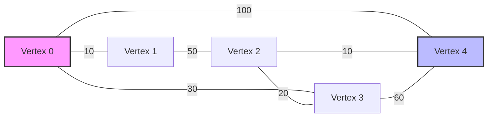
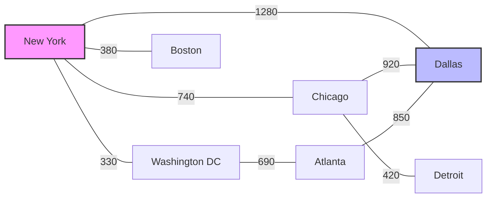

# Dijkstra's Algorithm Implementation

## Overview

This repository contains a Python implementation of **Dijkstra's Algorithm**, a classic graph algorithm for finding the shortest path between nodes in a weighted graph. The implementation uses an adjacency matrix representation of the graph and includes comprehensive testing to ensure correctness.

## Visual Representation of the Graph

Below is a visualization of the graph used in our example. The numbers on the edges represent the weights (or distances) between vertices.



The graph above corresponds to the following adjacency matrix:

```
[
    [0, 10, 0, 30, 100],
    [10, 0, 50, 0, 0],
    [0, 50, 0, 20, 10],
    [30, 0, 20, 0, 60],
    [100, 0, 10, 60, 0]
]
```
## Shortest Path Found

In this example, when finding the shortest path from **Vertex 0** to **Vertex 4**, the algorithm determines that the optimal route is:


**Path:** `[0, 3, 2, 4]` with a total distance of **60 units**

## Example with Cities

To illustrate the algorithm with a more concrete example, we can imagine that the vertices are cities and the weights are distances in kilometers:



If we want to find the shortest path from **New York** to **Dallas**, the algorithm will determine that the optimal route is:


**Path:** `New York → Chicago → Dallas` with a total distance of **1660 km**

This is shorter than going through Atlanta (NY → DC → ATL → DAL), which would be 2030 km.

## Algorithm Details

Dijkstra's algorithm works by maintaining a set of vertices whose shortest path from the source has been found. The algorithm repeatedly selects the vertex with the minimum distance value from the set of unvisited vertices, adds it to the visited set, and updates the distances to its adjacent vertices.

### Time Complexity

- **Time Complexity**: O(V²) where V is the number of vertices
- **Space Complexity**: O(V) for storing distances, visited status, and previous vertices


## Usage Example

```python
from dijkstra import Dijkstra

# Define a graph as an adjacency matrix
# 0 means no direct connection between vertices
# Positive values represent the weight/distance between vertices
graph = [
    [0, 10, 0, 30, 100],
    [10, 0, 50, 0, 0],
    [0, 50, 0, 20, 10],
    [30, 0, 20, 0, 60],
    [100, 0, 10, 60, 0]
]

# Create a Dijkstra instance
dijkstra = Dijkstra(graph)

# Find the shortest path from vertex 0 to vertex 4
path = dijkstra.find_shortest_path(0, 4)

print(f"Shortest path: {path}")
print(f"Distances from start: {dijkstra.get_distances()}")
```

## Tests

The implementation comes with comprehensive unit tests that verify:

1. Correct initialization of data structures
2. Proper identification of minimum distance vertices
3. Accurate distance updates
4. Correct path construction
5. Handling of edge cases:
   - Graphs without edges
   - Invalid inputs (negative weights, empty graphs)
   - Invalid start/end vertices

Run the tests using:

```
python -m unittest tests.test_dijkstra
```

## Input Format

The algorithm expects the graph to be represented as an adjacency matrix where:
- `graph[i][j]` represents the weight of the edge from vertex `i` to vertex `j`
- `0` indicates no direct connection between vertices
- All weights must be non-negative (a requirement for Dijkstra's algorithm)

## Limitations

1. This implementation uses a simple linear search to find the minimum distance vertex, which results in O(V²) time complexity. For sparse graphs, a min-heap implementation would be more efficient.
2. The algorithm does not support negative edge weights, as this is a fundamental limitation of Dijkstra's algorithm.
3. The graph is represented as an adjacency matrix, which is efficient for dense graphs but uses O(V²) space even for sparse graphs.

## Future Improvements

Possible enhancements to consider:
- Implement a priority queue to improve time complexity to O((V+E)log V)
- Add support for adjacency list representation for better space efficiency with sparse graphs
- Implement path visualization
- Add support for directed graphs

## Contributing

Contributions are welcome! Please feel free to submit a Pull Request.